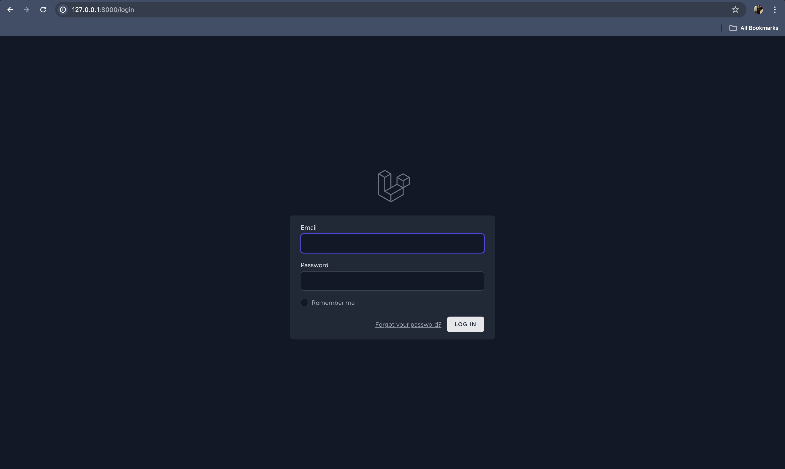
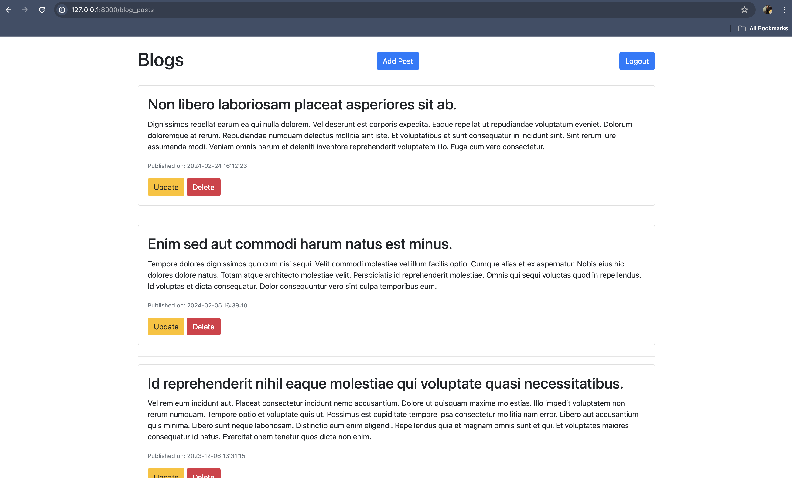
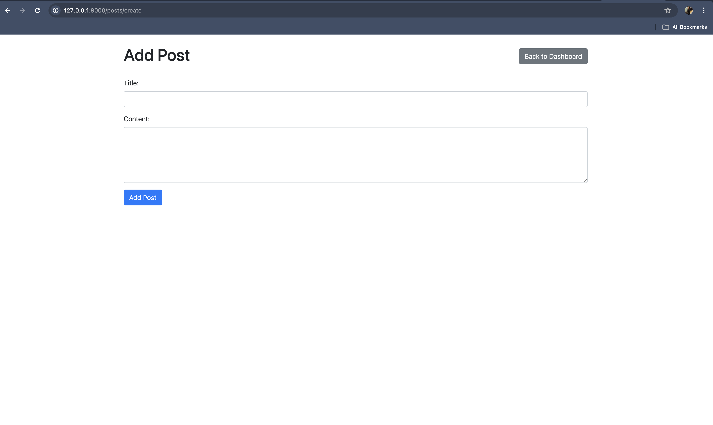
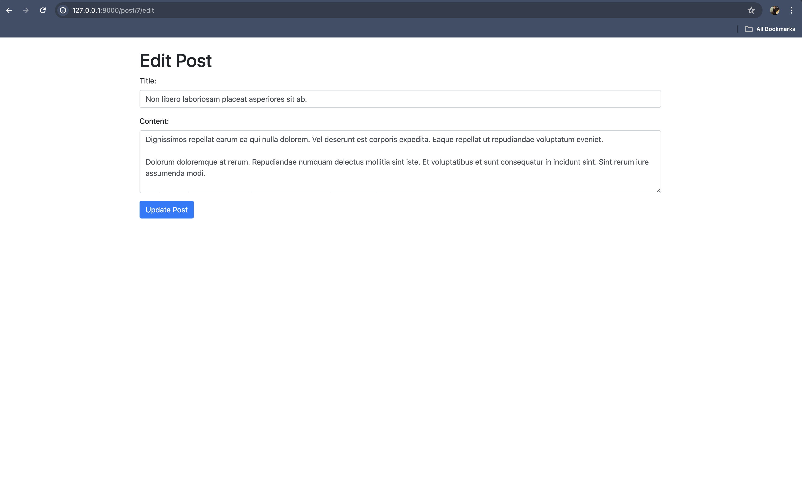

# Blog Management System

## Introduction
Welcome to the Blog Management System! This web application provides users with a platform to manage their blog posts efficiently. Users can log in, view all their posts, add new posts, update existing posts, and delete posts as needed.

## Features and Database Schema
### Features:
- **User Authentication:** Users can log in securely to access their account.
- **View Posts:** Users can view all their posts on the dashboard.
- **Add New Post:** Users can create and publish new blog posts.
- **Update Post:** Users can edit and update existing blog posts.
- **Delete Post:** Users can delete unwanted blog posts.
  
### Database Schema:
The database schema consists of the following tables:
- **Users:** Stores user account information.
- **Blog Posts:** Stores information about each blog post, including title, content, and publication date.

## Screenshots
### Login Page

### Dashboard - View All Posts

### Add New Post

### Update Post

